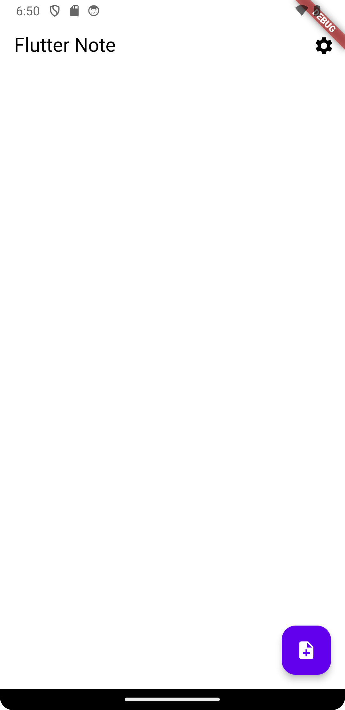

# Flutter Note - simple note taking application written in Flutter

This application was created for academic purposes using Flutter. 
It's simple and minimalistic to the core, so it offers basic functions such as saving notes, editing notes, and displaying notes on screen.
Additionaly it is possible to change application theme from light to dark, and vice-versa.

## Screenshots

