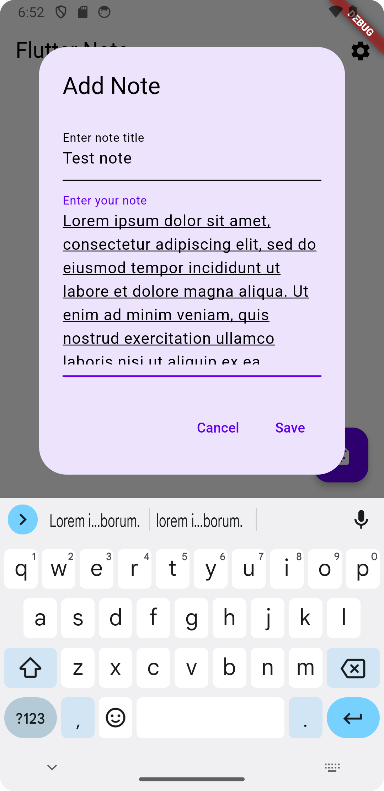
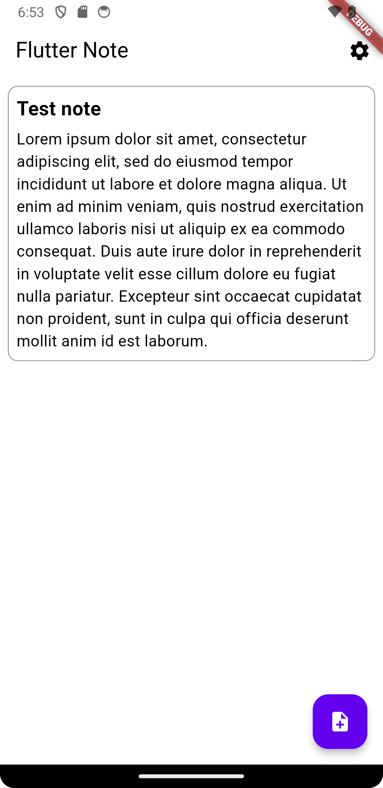
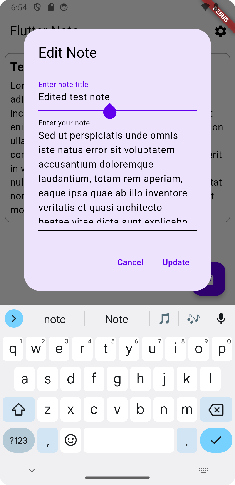
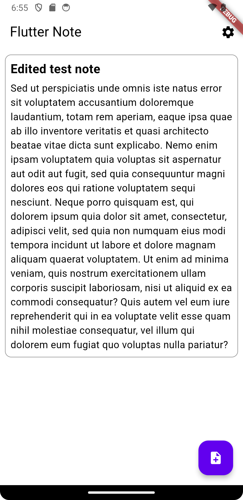
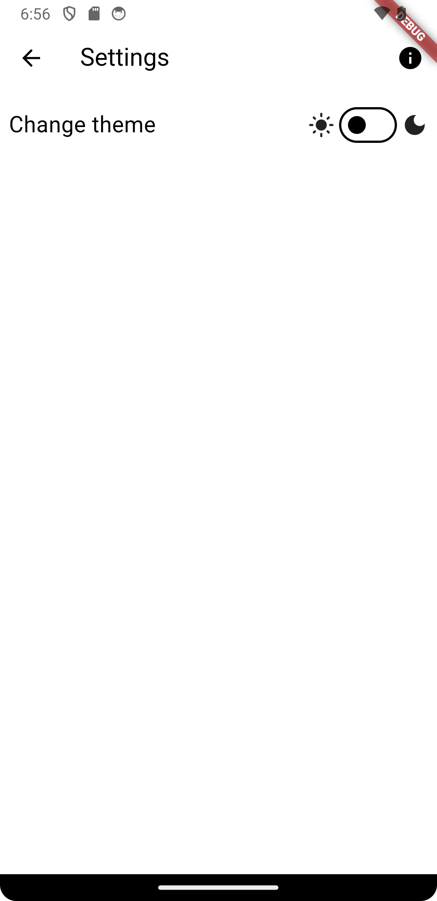
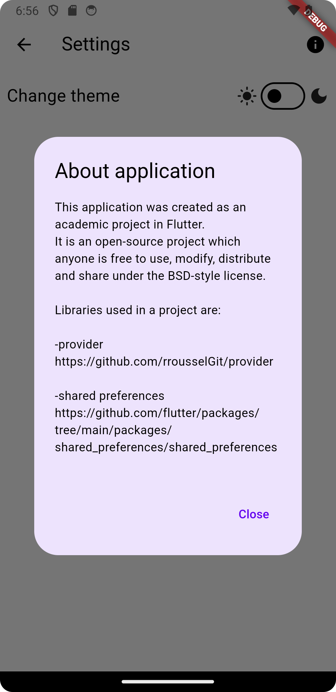
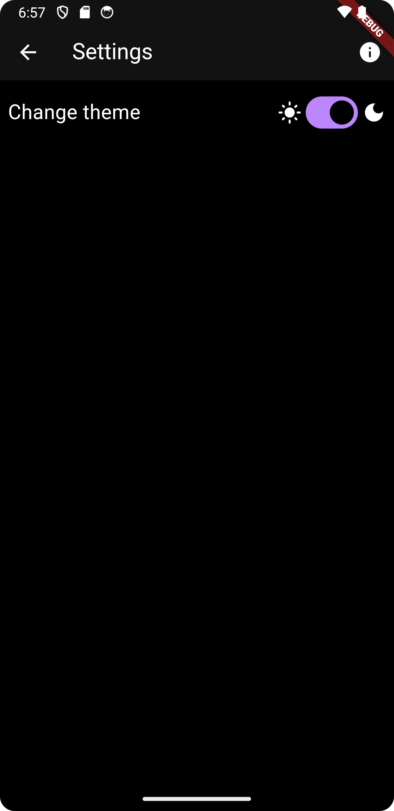
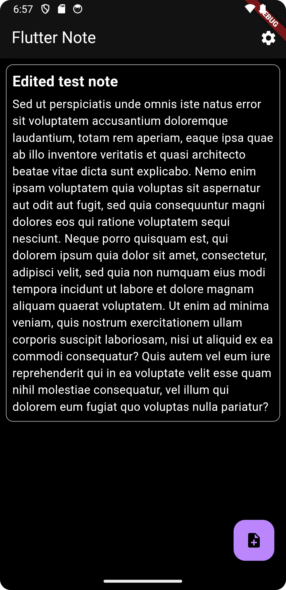
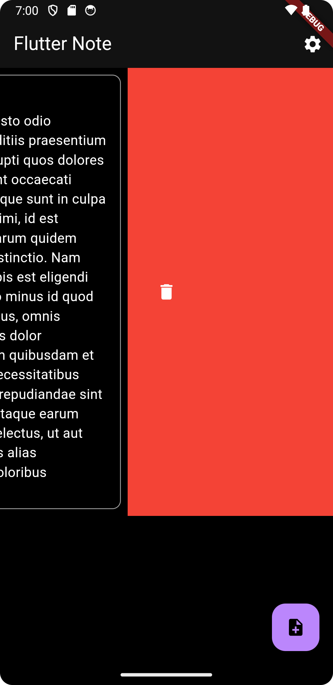

# Flutter Note - simple note taking application written in Flutter

This application was created for academic purposes using Flutter. 
It's simple and minimalistic to the core, so it offers basic functions such as saving notes, editing notes, and displaying notes on screen.
Additionaly it is possible to change application theme from light to dark, and vice-versa.

## Screenshots

### Application main screen

### Note adding dialog box

### Added note in main screen

### Note editing dialog box

### Edited note in main screen

### Application settings screen

### "About app" dialog box

### Application settings screen with dark theme

### Application main screen with dark theme

### Scrolling behaviour

### Deleting note by swiping left or right

